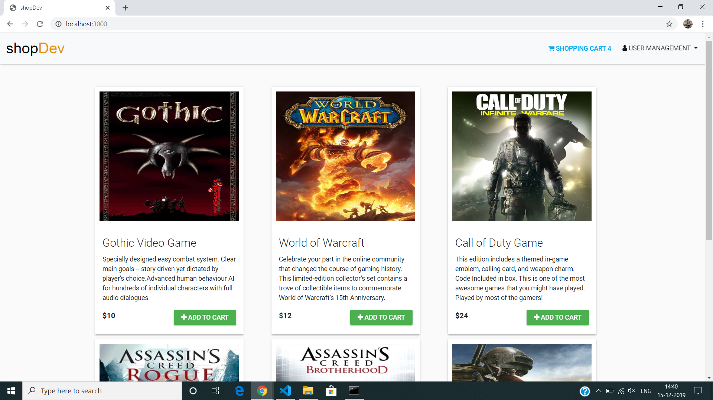
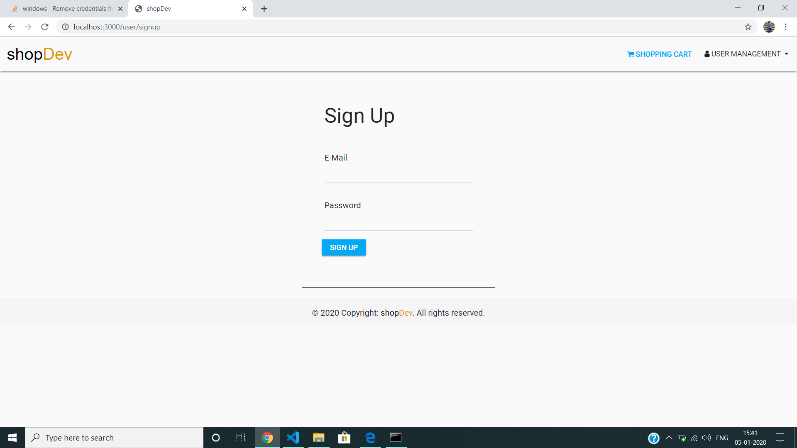
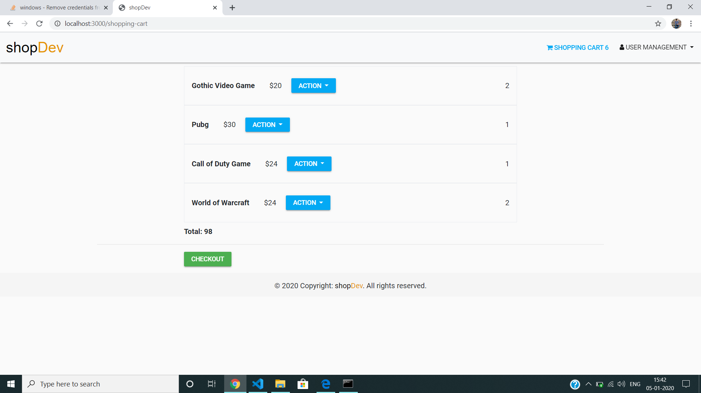
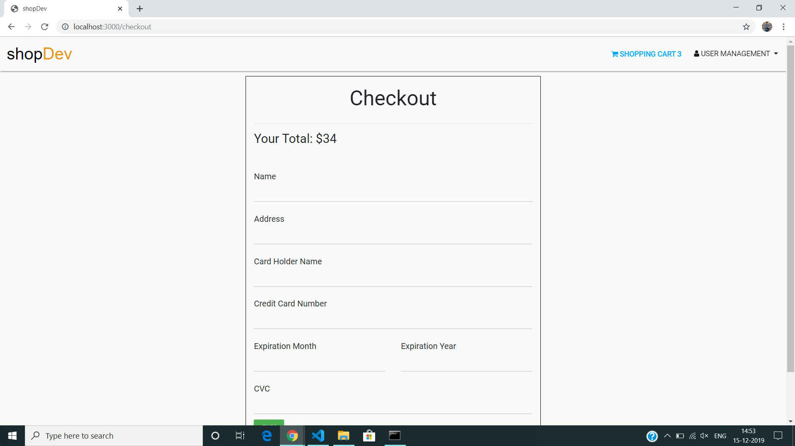

# shopDev

An e-commerce site. (shopDev)

## Requirements:

1. Nodejs
2. Mongodb

## Installation Process:

1. Clone this repo.
2. Run `npm install` to install required dependencies.
3. Connect mongodb to port: `27017`.
4. Run `product-seeder.js` file to store products in database.
5. Run `npm start` to start the server at: `http://localhost:3000/`

## Screenshots:

1.

2.

3.

4. 

### Special Tag:

This project uses local strategy for user authentication.
It uses `stripe` API for online payment process.
